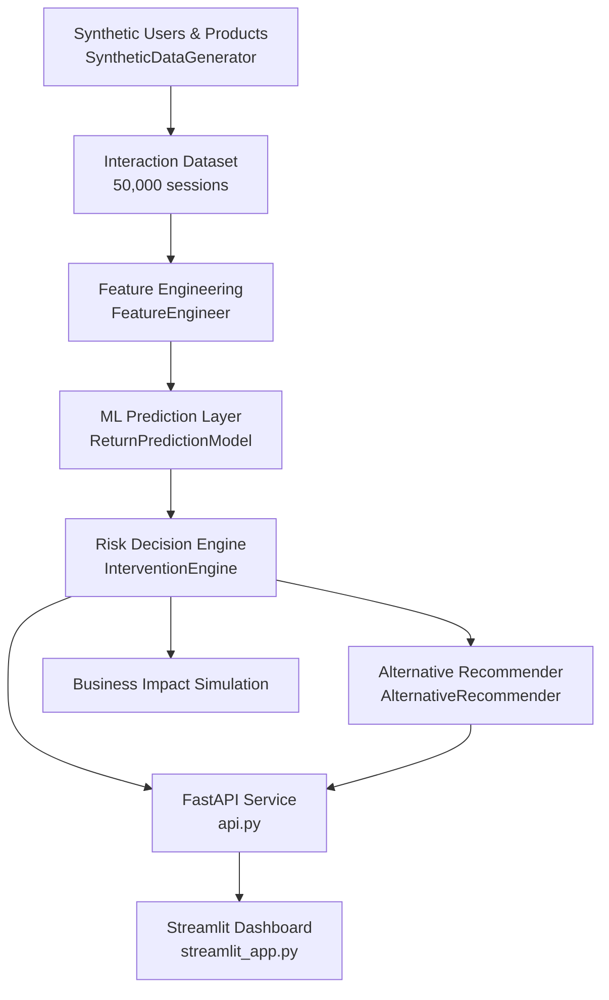

# 🛡️ RegretShield

> **Predictive Decision Intelligence for Proactive E-Commerce Return Prevention**


E-commerce returns are expensive, and by the time a return happens the cost has already been locked in. RegretShield's premise is that return risk is often visible **before** checkout, in the way a customer browses a product: how long they linger, how far they scroll, how many images they view, whether they abandon the cart. RegretShield turns those behavioral signals into a return-risk score, then routes that score through a decision layer that chooses to allow, warn, or block the purchase — surfacing lower-risk alternatives when it intervenes. A FastAPI service exposes this as a real-time prediction endpoint, a Streamlit dashboard makes the risk score and decision inspectable, and a business-impact simulation estimates what the intervention policy would be worth on historical data. The system is trained and evaluated end-to-end on a synthetic dataset generated by the project itself.

---

## Why RegretShield?

Most recommendation systems optimize a single question:

```text
User → Recommendation → Purchase
```

RegretShield asks a different question — not *what should this user buy*, but *how risky is what they're about to buy, and what should the system do about it*:

```text
User
 ↓
Behavior Analysis (time on page, scroll depth, image/review interaction)
 ↓
Return Risk Prediction
 ↓
Risk-Based Decision Engine
 ↓
Intervention (allow / warn / block)
 ↓
Alternative Recommendation
 ↓
Business Impact Estimate
```

The core idea running through the codebase: **the model produces a probability, not a decision**. A separate decision layer (`InterventionEngine`) converts that probability into an action, and a recommendation layer (`AlternativeRecommender`) supplies a fallback when the action isn't "allow."

---

## System Architecture



This mirrors the actual call graph: `api.py` loads a single joblib artifact bundle (`feature_engineer`, `model`, `products`, `users`) produced by `train.py`, then wires `InterventionEngine` and `AlternativeRecommender` around it for every `/predict` call.

---

## 🧠 Machine Learning Pipeline

`train.py` runs a five-stage pipeline:

1. **Synthetic data generation** — `SyntheticDataGenerator.generate_full_dataset()` produces users, products, and interaction records (5,000 users / 1,000 products / 50,000 interactions in the reference run), each interaction labeled with a `return` outcome.
2. **Feature engineering** — `FeatureEngineer` is fit on the interaction data (merged with product category and user category-affinity columns) and transforms it into a model-ready feature matrix. Behavioral inputs captured at request time include `time_on_page`, `scroll_depth`, `num_images_viewed`, `review_hover_count`, `add_to_wishlist`, and `cart_abandonment`; engineered outputs include aggregate signals like `user_return_rate`, `product_risk_score`, `engagement_score`, `avg_scroll_depth`, and `low_engagement_flag`.
3. **Train/test split** — stratified 80/20 split on the `return` label, seeded via `RANDOM_SEED` from `src/config.py`.
4. **Model training** — `ReturnPredictionModel.train()` fits multiple classifiers and reports train-set AUC for each.
5. **Evaluation & selection** — `ReturnPredictionModel.evaluate()` scores every model on the held-out test set (ROC-AUC, precision/recall at a 0.6 threshold, calibration curve), and `train.py` selects whichever model has the highest test ROC-AUC as `best_model`.

These signals are useful precisely because they're available *before* the purchase completes: a user who scrolls past a product quickly, skips the reviews, and has a history of returning similar items is a very different risk profile from one who reads reviews carefully and has a low personal return rate — even though both might click "buy."

---

## 📊 Model Comparison

Reference results from a `train.py` run (test set, 0.6 threshold):

| Model               | ROC-AUC | Precision |
| -------------------- | ------: | --------: |
| Logistic Regression   |   0.758 |     0.700 |
| Gradient Boosting      |   0.758 |     0.710 |
| Random Forest          |   0.736 |     0.673 |

**Selected model:** Logistic Regression (ROC-AUC 0.7583, Precision 0.700, Recall 0.163). At the chosen threshold, the model trades a lot of recall for precision — it flags a purchase as high-risk only when fairly confident, which fits an intervention that can annoy or block a legitimate customer if it fires too often.

**Top predictive features** (from the selected model's feature importance):

| Feature             | Importance |
| -------------------- | ---------: |
| `user_return_rate`     |       5.44 |
| `product_risk_score`   |       5.03 |
| `low_engagement_flag`  |       0.40 |
| `avg_scroll_depth`     |       0.27 |
| `engagement_score`     |       0.25 |

By a wide margin, a user's historical return rate and a product's baseline risk dominate the signal — the real-time behavioral features (scroll depth, engagement) add a smaller but non-trivial refinement on top.

> **Note on model selection:** `train.py`'s evaluation loop picks `best_model` purely by test ROC-AUC across whatever models `ReturnPredictionModel` trains. `api.py`, however, hardcodes inference to `model.predict_proba(X, 'xgboost')` and SHAP explanations to `model.explain_prediction(X, 'xgboost')`, regardless of which model won the comparison. That means the model actually serving `/predict` in the current codebase is XGBoost, not necessarily the `best_model` reported by training — this is called out here rather than glossed over. See [Limitations](#-limitations).

---

## ⚡ Risk-Based Decision Engine

The model's output is a probability, not an action. `InterventionEngine` (constructed with `threshold=0.6` in both `train.py` and `api.py`) maps that probability onto a decision:

```text
Risk Score
    │
    ├── < 60%        → Allow Purchase
    ├── 60% – 85%     → Warn Customer + Recommend Alternatives
    └── > 85%         → Block Purchase
```

`evaluate_purchase()` returns a `decision` (`allow` / `warn` / `block`), an optional `warning_message`, and the `threshold_used` — all of which flow straight into the API response. The same engine also exposes `simulate_business_impact()` for offline evaluation and `get_stats()`, which backs the `/stats` endpoint.

---

## 🔄 Alternative Recommendation Engine

When a purchase is warned or blocked, `AlternativeRecommender.recommend_alternatives(user_id, product_id, original_features, top_k=3)` returns lower-risk products in the same context — each with its own predicted `return_risk`, `category`, `price`, and `rating`, so the dashboard and API can show *why* an alternative is safer, not just that it exists. The recommender is initialized with the same `products_df`, `feature_engineer`, and `model` used for prediction, so alternatives are scored through the identical risk model rather than a separate similarity heuristic.

---

## 📈 Business Impact Simulation

`train.py` runs `InterventionEngine.simulate_business_impact()` on the real held-out test set (actual labels vs. predicted probabilities) after training:

| Metric                          | Value    |
| -------------------------------- | -------: |
| Baseline Return Rate             |   26.1%  |
| Return Rate After Intervention   |   23.2%  |
| Return Rate Reduction            |   11.3%  |
| Interventions Triggered          |     609  |
| Estimated Savings                | $14,780  |

> **Simulation results ≠ production business results.** These numbers come from applying the decision policy retroactively to a synthetic test set, assuming interventions are effective at preventing the return. They demonstrate the *mechanics* of the impact calculation, not a validated real-world outcome.

**Separately**, the "Business Impact Simulation" panel in `streamlit_app.py` is a live, in-browser demo, not a read of the trained model's real results — it samples `actual_returns = np.random.beta(2, 8, 1000)`, adds noise to produce `predicted_returns`, and recomputes reduction/interventions/savings from that synthetic sample on every page interaction. It's a good interactive way to *feel* how threshold and intervention-effectiveness sliders move the numbers, but it is not connected to `models/evaluation_metrics.json` or the trained model's actual predictions the way the ROC-AUC and calibration charts above it are.

---

## ⚡ FastAPI Service

`api.py` loads `models/regret_shield_artifacts.pkl` (feature engineer, model, products, users) once at startup and serves:

| Method | Endpoint    | Purpose                                             |
| ------ | ----------- | ---------------------------------------------------- |
| GET    | `/`          | Root — lists available endpoints                     |
| GET    | `/health`    | Health check, confirms artifacts loaded               |
| POST   | `/predict`   | Return-risk prediction, decision, alternatives        |
| GET    | `/stats`     | Intervention statistics from `InterventionEngine`     |
| GET    | `/docs`      | Auto-generated Swagger/OpenAPI documentation          |

Request lifecycle inside `/predict`:

```text
Client
  ↓
Validate user_id / product_id exist
  ↓
Build feature row → FeatureEngineer.transform()
  ↓
model.predict_proba(X, 'xgboost')
  ↓
InterventionEngine.evaluate_purchase()
  ↓
model.explain_prediction(X, 'xgboost')  (SHAP, best-effort)
  ↓
AlternativeRecommender.recommend_alternatives()
  ↓
JSON PredictionResponse
```

Unknown `user_id` or `product_id` values return a `404`; a feature-engineering failure returns a `500`. SHAP explanation is wrapped in a bare `try/except` and silently falls back to `risk_factors: null` on failure.

### Example request

```bash
curl -X POST "http://localhost:8000/predict" \
  -H "Content-Type: application/json" \
  -d '{
    "user_id": 123,
    "product_id": 456,
    "time_on_page": 45.5,
    "scroll_depth": 0.7,
    "num_images_viewed": 4,
    "review_hover_count": 3,
    "add_to_wishlist": 0,
    "cart_abandonment": 0
  }'
```

### Example response

```json
{
  "return_probability": 0.24,
  "decision": "allow",
  "warning_message": null,
  "alternatives": [
    {
      "product_id": 789,
      "category": "electronics",
      "price": 49.99,
      "return_risk": 0.18,
      "rating": 4.5
    }
  ],
  "threshold_used": 0.6
}
```

`return_probability` is the model's raw risk estimate; `decision` is what `InterventionEngine` chose to do with it; `alternatives` is empty when the decision is `allow`; `threshold_used` reflects the 0.6 warn/allow boundary the engine was configured with.

---

## 📊 Decision Intelligence Dashboard

`streamlit_app.py` is a two-column operational view, not just a static chart page:

- **System Performance** — ROC-AUC bar chart per trained model and a calibration-curve comparison, both read live from `models/evaluation_metrics.json`.
- **Test Prediction** — pick a real user and product from the trained artifacts, adjust behavioral sliders (time on page, scroll depth, images viewed, review hovers), and call the live `/predict` endpoint. Results render as a risk gauge (colored by the configurable threshold slider), the allow/warn/block decision, the top SHAP risk factors (when available), and a table of recommended alternatives.
- **Business Impact Simulation** — an interactive, randomly-sampled demo of how threshold and intervention-effectiveness assumptions move return-rate reduction, hourly interventions, and estimated savings (see the caveat above — this panel is illustrative, not a readout of the trained model).
- **Product Risk Heatmap** — a treemap of average `return_rate_by_category` across the product catalog.

```text
📸 Dashboard Preview
Coming soon — no screenshots are currently checked into the repository.
```

---

## 📁 Project Structure

```text
RegretShield/
│
├── src/
│   ├── config.py               # RANDOM_SEED and shared configuration
│   ├── dataset_generator.py    # SyntheticDataGenerator — users, products, interactions
│   ├── feature_engineering.py  # FeatureEngineer — fit/transform pipeline
│   ├── model.py                # ReturnPredictionModel — train/evaluate/predict/explain
│   ├── intervention_engine.py  # InterventionEngine — decision policy + business simulation
│   └── recommender.py          # AlternativeRecommender — lower-risk alternatives
│
├── models/                     # Saved artifacts, evaluation metrics, feature importance
├── train.py                    # End-to-end training pipeline (data → model → artifacts)
├── api.py                      # FastAPI inference service
├── streamlit_app.py            # Interactive dashboard
├── requirements.txt
└── README.md
```

---

## 🚀 Quick Start

```bash
git clone https://github.com/Aivexh/RegretShield.git
cd RegretShield

python -m venv venv
source venv/bin/activate      # venv\Scripts\activate on Windows

pip install -r requirements.txt

python train.py               # generates data, trains models, saves artifacts
python api.py                 # serves the API on http://localhost:8000
streamlit run streamlit_app.py  # dashboard on http://localhost:8501
```

## Installation

### Prerequisites

Python 3.x with `pip` and `venv` available.

### Clone

```bash
git clone https://github.com/Aivexh/RegretShield.git
cd RegretShield
```

### Virtual environment

**Windows**
```bash
python -m venv venv
venv\Scripts\activate
```

**Linux / macOS**
```bash
python3 -m venv venv
source venv/bin/activate
```

### Dependencies

```bash
pip install --upgrade pip
pip install -r requirements.txt
```

### Run order

1. `python train.py` — must run first; it generates the synthetic dataset, trains and evaluates all models, and writes `models/regret_shield_artifacts.pkl`, `models/evaluation_metrics.json`, and `models/feature_importance.csv`.
2. `python api.py` — loads the saved artifacts and serves `/predict`, `/health`, `/stats` on port 8000.
3. `streamlit run streamlit_app.py` — reads the same artifacts directly (for the sidebar/chart data) and calls the running API (for live predictions) on port 8501.

---

## 🧩 Tech Stack

| Layer          | Technology            | Purpose                                  |
| -------------- | ---------------------- | ------------------------------------------ |
| Language        | Python                  | Core implementation                        |
| ML              | scikit-learn, XGBoost   | Model training, tree-based prediction      |
| Explainability  | SHAP                    | Per-prediction risk-factor explanations    |
| Data            | pandas, NumPy           | Data generation and processing             |
| API             | FastAPI, Pydantic, Uvicorn | Model serving, request validation, ASGI |
| Dashboard       | Streamlit, Plotly       | Interactive decision-intelligence UI       |
| Serialization   | joblib                  | Persisting the trained artifact bundle     |

---

## 🧩 Engineering Highlights

- Clear separation between the **ML layer** (`model.py`), the **decision layer** (`intervention_engine.py`), and the **serving layer** (`api.py`) — the model never returns a business decision directly.
- Reusable feature pipeline: the same `FeatureEngineer` instance is fit once during training and reused unchanged at inference time via the joblib artifact bundle, avoiding train/serve skew in feature construction.
- A model-comparison step is built into training rather than assumed — `evaluate()` scores every candidate model on the same held-out set before anything is selected.
- Alternatives are generated through the same risk model used for the primary prediction, so a recommended alternative's `return_risk` is directly comparable to the original product's.
- The business-impact simulation is a first-class output of training (`models/evaluation_metrics.json`, printed savings estimate) rather than a number computed only for the README.

---

## 🏛️ Key Design Decisions

> **FastAPI for model serving**
>
> Decision: expose inference through a REST API rather than calling the model directly from Streamlit.
> Reason: decouples the prediction/decision logic from any particular UI and lets other clients (curl, another frontend) call `/predict`.
> Trade-off: introduces a network hop and a second process to run and keep in sync with the trained artifacts.

> **Single joblib artifact bundle**
>
> Decision: package the feature engineer, model, and reference product/user tables into one `regret_shield_artifacts.pkl`.
> Reason: guarantees the API is always scoring with the exact feature pipeline and model that were trained together.
> Trade-off: the bundle must be regenerated and redeployed together — there's no way to update the model without also re-shipping the feature engineer and reference data.

> **Fixed 0.6 threshold, hardcoded across two files**
>
> Decision: `InterventionEngine(threshold=0.6)` is instantiated independently in both `train.py` and `api.py`.
> Reason: keeps the training-time business simulation and the live decision policy aligned.
> Trade-off: the threshold isn't read from a shared config value, so it's easy for the two call sites to drift if one is edited and the other isn't.

---

## ⚠️ Limitations

- **Synthetic data end-to-end.** Users, products, and interactions are generated by `SyntheticDataGenerator`, not collected from real e-commerce traffic — model performance and business-impact numbers reflect the assumptions baked into that generator, not real customer behavior.
- **Model selection vs. serving mismatch.** `train.py` selects `best_model` by test ROC-AUC (Logistic Regression in the reference run), but `api.py` hardcodes `/predict` and SHAP explanations to `'xgboost'` regardless of which model actually won the comparison. The README's "best model" metrics and the model actually answering API requests are not currently guaranteed to be the same model.
- **Dashboard business-impact panel is a live random sample**, not a readout of the trained model's real evaluation — see the caveat in [Business Impact Simulation](#-business-impact-simulation).
- **Low recall at the chosen threshold.** The selected model's Recall of 0.163 at the 0.6 threshold means most actual returns are not flagged in advance; the system is tuned to be confident when it does intervene, at the cost of catching the majority of return cases.
- **No automated test suite** is present in the repository — validation is currently manual (`curl` calls against `/health` and `/predict`, and inspecting `models/evaluation_metrics.json`).
- **No persistence layer, authentication, or request throttling** — the API assumes trusted, low-volume local usage.

---

## 🔮 Future Roadmap

*(Not implemented — listed as future work only.)*

- Resolve the model-selection/serving mismatch by having `api.py` load and serve `best_model_name` from the saved artifacts instead of a hardcoded `'xgboost'`.
- Threshold and probability calibration tuning, informed by the calibration curves already computed in `evaluate()`.
- Promote SHAP explanations from a best-effort try/except to a guaranteed part of the response contract.
- Replace the dashboard's randomly-sampled business-impact panel with a live read of `models/evaluation_metrics.json` / the real simulation.
- Config-driven threshold shared between `train.py` and `api.py` instead of two hardcoded `0.6` literals.
- Real interaction-event data in place of the synthetic generator, for genuine external validation.
- Automated test coverage for the feature pipeline, decision engine, and API contract.
- Production considerations: authentication, rate limiting, model versioning, drift monitoring, containerized deployment.

---

## 🎯 What This Project Demonstrates

- End-to-end ML pipeline design: data generation → feature engineering → model comparison → artifact persistence.
- Separating a probabilistic model from the business logic that acts on it (decision engine as its own component).
- Recommendation logic that reuses the primary risk model rather than a separate, unvalidated heuristic.
- REST API design with Pydantic request/response validation and FastAPI's automatic OpenAPI docs.
- Building an interactive, multi-view Streamlit dashboard that mixes real model outputs (ROC-AUC, calibration, live predictions) with clearly-scoped illustrative demos.
- Honest evaluation practice: reporting model comparisons, calibration, and — in this README — the actual mismatches found while reading the code, rather than only the parts that look best.

---

## 📄 License

MIT License

## 👤 Author

**Monika Yadav**
GitHub: [github.com/Aivexh](https://github.com/Aivexh)

