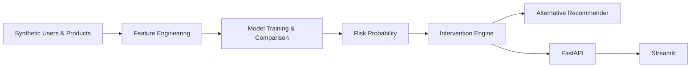

# 🛡️ RegretShield

### Predictive Decision Intelligence for E-Commerce Return Prevention


Predicts return risk from pre-purchase behavior, converts that risk into an allow/warn/block decision, and recommends lower-risk alternatives — served via FastAPI, visualized in Streamlit.

**[GitHub](https://github.com/Aivexh/RegretShield)**

---

## 📸 Dashboard

```text
📸 Preview coming soon — no screenshots currently checked into the repo.
```

The dashboard (`streamlit_app.py`) renders a live risk gauge, allow/warn/block decision, SHAP risk factors, recommended alternatives, model ROC-AUC/calibration charts, and a return-risk heatmap by category.

---

## Quick Overview

|                    |                                      |
| ------------------ | ------------------------------------ |
| 🎯 Problem          | Pre-purchase e-commerce return risk  |
| 🧠 Core             | Behavioral-signal risk classifier    |
| ⚡ Decision          | Risk score → allow / warn / block    |
| 🔄 Recommendation   | Lower-risk alternative products      |
| 📊 Analytics        | Business-impact simulation           |
| 🚀 API              | FastAPI                              |
| 🖥️ UI               | Streamlit                            |

---

## ✨ Features

- **Return Risk Prediction** — models return probability from behavioral + user/product signals.
- **Risk-Based Intervention** — `InterventionEngine` converts risk into allow/warn/block.
- **Alternative Recommendation** — surfaces lower-risk products when it intervenes.
- **Model Comparison** — Logistic Regression, Gradient Boosting, Random Forest evaluated head-to-head.
- **SHAP Explanations** — per-prediction risk factors (best-effort, falls back to `null`).
- **FastAPI Inference Service** — `/predict`, `/health`, `/stats`.
- **Streamlit Dashboard** — live predictions, model metrics, business-impact demo.

---

## Architecture



- `api.py` loads one joblib bundle (`feature_engineer`, `model`, `products`, `users`) built by `train.py`.
- `InterventionEngine` and `AlternativeRecommender` wrap the model at inference time — the model never returns a decision, only a probability.
- Streamlit reads training artifacts directly for metrics and calls the live API for predictions.

---

## Tech Stack

| Category        | Technology                     |
| ---------------- | -------------------------------- |
| Language          | Python                            |
| ML                | scikit-learn, XGBoost             |
| Explainability    | SHAP                              |
| Data              | pandas, NumPy                     |
| API               | FastAPI, Pydantic, Uvicorn        |
| Dashboard         | Streamlit, Plotly                 |
| Serialization     | joblib                            |

---

## Project Structure

```text
RegretShield/
├── src/
│   ├── config.py               # RANDOM_SEED
│   ├── dataset_generator.py    # synthetic users/products/interactions
│   ├── feature_engineering.py  # fit/transform pipeline
│   ├── model.py                # train/evaluate/predict/explain
│   ├── intervention_engine.py  # decision policy + business simulation
│   └── recommender.py          # alternative-product scoring
├── models/                     # saved artifacts, metrics
├── train.py                    # end-to-end training pipeline
├── api.py                      # FastAPI service
├── streamlit_app.py            # dashboard
└── requirements.txt
```

---

## ML Pipeline

```text
Synthetic Data → Feature Engineering → Model Training → Evaluation → Risk Probability → Decision Engine
```

| Stage      | Implementation                                                                 |
| ---------- | -------------------------------------------------------------------------------- |
| Data       | `SyntheticDataGenerator` — 5,000 users, 1,000 products, 50,000 interactions      |
| Features   | `time_on_page`, `scroll_depth`, `num_images_viewed`, `review_hover_count`, `user_return_rate`, `product_risk_score`, `engagement_score` |
| Models     | Logistic Regression, Gradient Boosting, Random Forest, XGBoost                   |
| Evaluation | Stratified 80/20 split, ROC-AUC, precision/recall @ 0.6, calibration curve       |
| Output     | Return probability → `InterventionEngine`                                        |

---

## Model Results

| Model               | ROC-AUC | Precision |
| -------------------- | ------: | --------: |
| Logistic Regression   |   0.758 |     0.700 |
| Gradient Boosting      |   0.758 |     0.710 |
| Random Forest          |   0.736 |     0.673 |

> **Selected by training pipeline:** Logistic Regression (ROC-AUC 0.758, Precision 0.700, Recall 0.163) — highest test ROC-AUC.
>
> **Note:** `api.py` hardcodes inference to `model.predict_proba(X, 'xgboost')`, not `best_model`. The model reported here as "best" is not guaranteed to be the model serving `/predict`. See [Limitations](#limitations).

Top features by importance: `user_return_rate` (5.44), `product_risk_score` (5.03), `low_engagement_flag` (0.40), `avg_scroll_depth` (0.27), `engagement_score` (0.25).

---

## Decision Engine

```text
              Risk Score
                  │
        ┌─────────┼─────────┐
        ↓         ↓         ↓
     < 60%     60–85%      > 85%
        │         │          │
      ALLOW      WARN      BLOCK
                  │
                  ↓
           RECOMMENDATIONS
```

- Threshold = `0.6`, set independently in `train.py` and `api.py` (`InterventionEngine(threshold=0.6)`).
- `evaluate_purchase()` returns `decision`, `warning_message`, `threshold_used`.
- WARN and BLOCK both trigger `AlternativeRecommender`, scored by the same risk model.
- `/stats` exposes running intervention counts via `get_stats()`.

---

## ⚡ API

| Method | Endpoint    | Description                       |
| ------ | ----------- | ------------------------------------ |
| GET    | `/`          | Root, lists endpoints                |
| GET    | `/health`    | Health check                         |
| POST   | `/predict`   | Return-risk prediction + decision    |
| GET    | `/stats`     | Intervention statistics              |
| GET    | `/docs`      | Swagger/OpenAPI docs                 |

```bash
curl -X POST "http://localhost:8000/predict" \
  -H "Content-Type: application/json" \
  -d '{
    "user_id": 123,
    "product_id": 456,
    "time_on_page": 45.5,
    "scroll_depth": 0.7,
    "num_images_viewed": 4,
    "review_hover_count": 3,
    "add_to_wishlist": 0,
    "cart_abandonment": 0
  }'
```

```json
{
  "return_probability": 0.24,
  "decision": "allow",
  "warning_message": null,
  "alternatives": [
    {"product_id": 789, "category": "electronics", "price": 49.99, "return_risk": 0.18, "rating": 4.5}
  ],
  "threshold_used": 0.6
}
```

Unknown `user_id`/`product_id` → `404`. Feature-engineering failure → `500`.

---

## Business Impact

| Metric                     |   Value  |
| ---------------------------- | -------: |
| Baseline Return Rate          |   26.1%  |
| Return Rate After Intervention |   23.2%  |
| Interventions Triggered       |     609  |
| Estimated Savings             | $14,780  |

**Simulation / Estimated** — computed by `InterventionEngine.simulate_business_impact()` retroactively on the held-out test set. Not a production result.

The Streamlit "Business Impact" panel is a separate, randomly-sampled live demo (`np.random.beta`) for exploring threshold sensitivity — it does not read the numbers above.

---

## 🚀 Quick Start

```bash
git clone https://github.com/Aivexh/RegretShield.git
cd RegretShield

python -m venv venv
source venv/bin/activate      # venv\Scripts\activate on Windows

pip install -r requirements.txt

python train.py               # generate data, train, save artifacts
python api.py                 # http://localhost:8000
streamlit run streamlit_app.py  # http://localhost:8501
```

---

## Reproducibility

```text
1. Install dependencies
2. python train.py   → generates dataset, trains models, saves models/regret_shield_artifacts.pkl
3. python api.py      → serves /predict, /health, /stats
4. streamlit run streamlit_app.py
```

Seeded via `RANDOM_SEED` in `src/config.py`.

---

## Limitations

- End-to-end synthetic data — no real e-commerce traffic.
- `api.py` serves XGBoost regardless of which model `train.py` selects as `best_model`.
- Business-impact numbers are simulated, not production-validated.
- Recall of 0.163 at threshold 0.6 — most true returns aren't flagged.
- No automated test suite, auth, or rate limiting.

---

## Roadmap

```text
- [x] ML risk prediction
- [x] Decision engine
- [x] Recommendation layer
- [x] FastAPI service
- [x] Streamlit dashboard
- [ ] api.py serves best_model_name instead of hardcoded xgboost
- [ ] Shared config-driven threshold
- [ ] Real interaction data
- [ ] Automated tests
- [ ] Production deployment (auth, monitoring, drift detection)
```

---

## License

MIT

## Author

**Monika Yadav** — [github.com/Aivexh](https://github.com/Aivexh)


